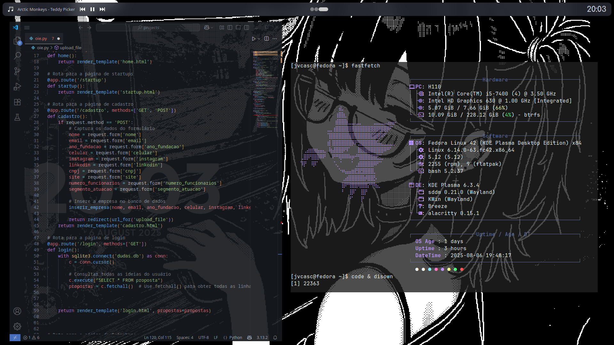

# [KDE] Linux ricing

Just the backup files of my Linux ricing that I made for fun

## !!!

**OS:** Fedora  
**Terminal:** Alacritty  
**Fetch:** fastfetch  
**Spotify:** spicetify  
**VSCode Plugin:** [Glass-it](https://marketplace.visualstudio.com/items?itemName=s-nlf-fh.glassit)  
**Widgets:** ModernClock, Ginti, PlayMusicToolBar
